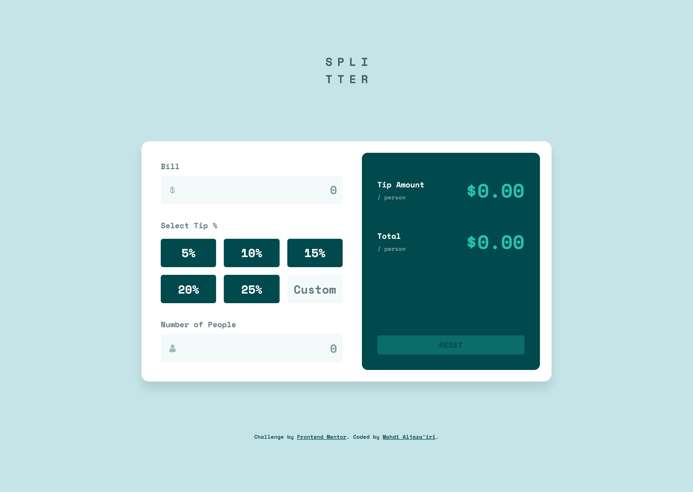

# Frontend Mentor - Tip calculator app solution

This is a solution to the [Tip calculator app challenge on Frontend Mentor](https://www.frontendmentor.io/challenges/tip-calculator-app-ugJNGbJUX).  
Frontend Mentor challenges help you improve your coding skills by building realistic projects.

\*Me\* : I agree 👍

## Table of contents

- [Overview](#overview)
  - [The challenge](#the-challenge)
  - [Screenshot](#screenshot)
  - [Links](#links)
- [My process](#my-process)
  - [Second Attempt](#second-attempt)
  - [Hardest part](#hardest-part)
  - [What I learned](#what-i-learned)
- [Tools](#tools)
- [Author](#author)

## Overview

### The challenge

Users should be able to:

- View the optimal layout for the app depending on their device's screen size
- See hover states for all interactive elements on the page
- Calculate the correct tip and total cost of the bill per person

### Screenshot

### Links

- Solution URL: <https://www.frontendmentor.io/solutions/no-tipping-here-2nd-attempt-ad3ViqUuT5>
- Live Site URL: <https://tip-calculator-app-solution-2nd-1234.netlify.app>

## My process

### Second Attempt

I have returned to this project and spent some serious amount of effort on responsibility of the page on different -even bizarre- screen sizes.

I knew I had to use Grid, but I was't sure about what to do to get it the way I want. It needed a great deal of fine-tuning to bring this result. It wasn't a long process, though.

One of the most frustrating areas was the hero image section. As spaces above and beneath it can get drastically huge on mobiles. Later did I realize I needed to specify the hero section's height on small screen widths with `vh` units instead of `fr` units, inorder to make it grow and shrink regardless of how much free space there is.

After this, I did for sure learn a lot about grid areas and how to make use of them. And although I have approached it desktop-first rather than mobile-first, I honestly don't think it's a big deal since it works fine.

### Hardest part

Managing all the alerts systematically was the most troublesome part of the process. But this project gave me confidence to work with Javascript.

### What I learned

Programming is so damn HARD! And so is responsive layout.. 😐

Also, the `in` operator tests presence of keys/indexes, not values. Learned the hard way.

## Tools

- [Dev Docs](https://devdocs.io) - The resource I was constantly referring to throughout the process. It's an offline web app that has a huge collection of documentations.
- [Brackets](https://brackets.io) - My text editor. Not as powerful as VSCode, but still my favorite.
- Chrome - This web page was only tested on Chrome. 

## Author

- GitHub - [Mahdi Aljaza'iri](https://github.com/MahdiAljazairi)
- Frontend Mentor - [@MahdiAljazairi](https://www.frontendmentor.io/profile/MahdiAljazairi)
